# NLEx Router

A multi-tenant Natural Language Execution Router: an AI-assisted workflow runner to execute Elixir modules with OTP execution guarantees.

Uses **Reactor** for workflow orchestration, **Oban** for durable job processing.
**Phoenix** is used as the HTTP/webhook gateway, and Telegram for mobile devices.

## Design philosophy

Small cloud LLMs, structured outputs, no generated SQL: the LLM picks from a known action set — it never writes free-form code or queries.

- **Constrained classification** — a lightweight model routes user input to predefined workflows and actions. Hallucinations are structurally impossible: the LLM can only select from the registry, not invent capabilities.
- **Two-pass hierarchical routing** — Pass 1 identifies the workflow (cheap, small prompt), Pass 2 extracts the action and parameters (scoped prompt, fewer tokens). Each pass uses the smallest model that gets the job done.
- **Prompt-driven routing** — each registry action carries a `prompt_hint` (e.g. "crée, ajoute un contact") that guides the LLM. No embeddings, no example bank — the prompt is explicit enough for reliable routing across 5 workflows.

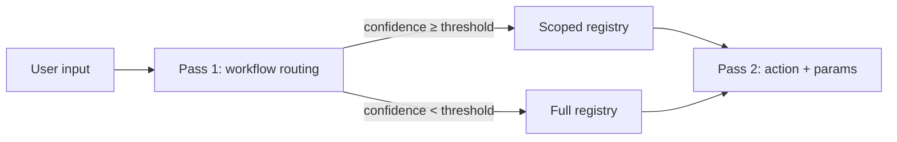

## Architecture

#### Ingestion pipeline

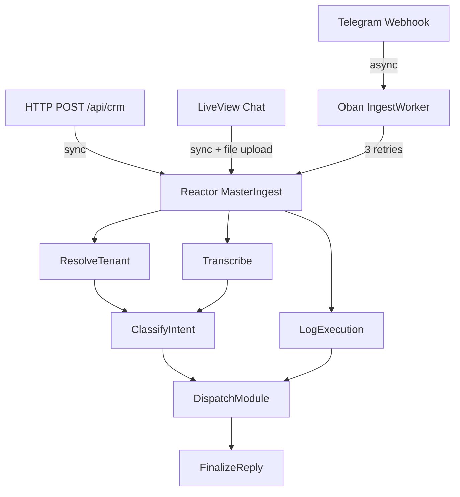

#### Workflow modules

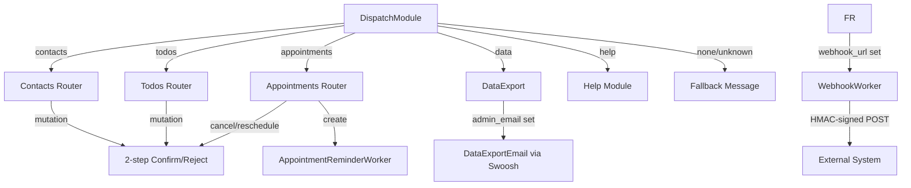

#### Background workers

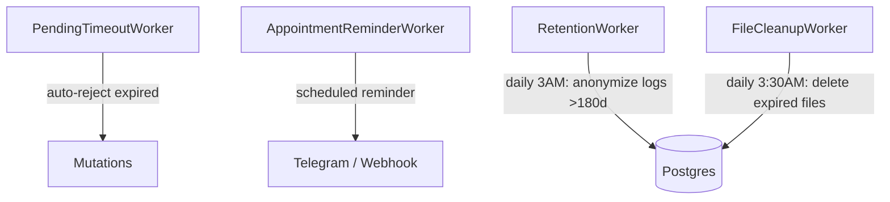

### MasterIngest Reactor DAG

Auto-generated via `Reactor.Mermaid.to_mermaid/1` -- shows the actual step dependency graph with data flow edges.

Regenerate with:

```bash
mix run -e '{:ok, d} = Reactor.Mermaid.to_mermaid(CrmReactor.Reactors.MasterIngest, direction: :top_to_bottom, output: :binary); IO.puts(d)'
```

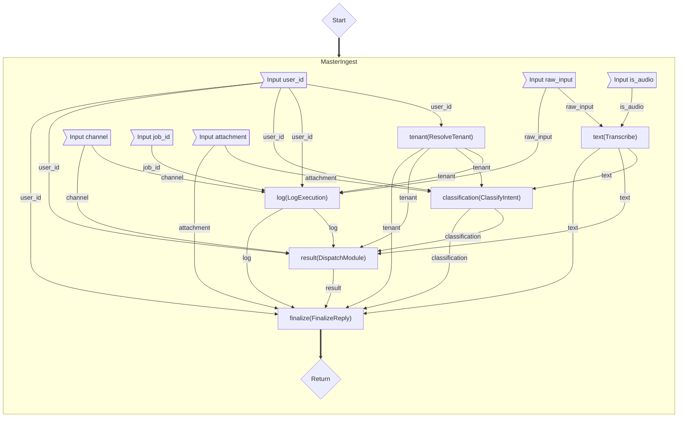


### Tiered query system

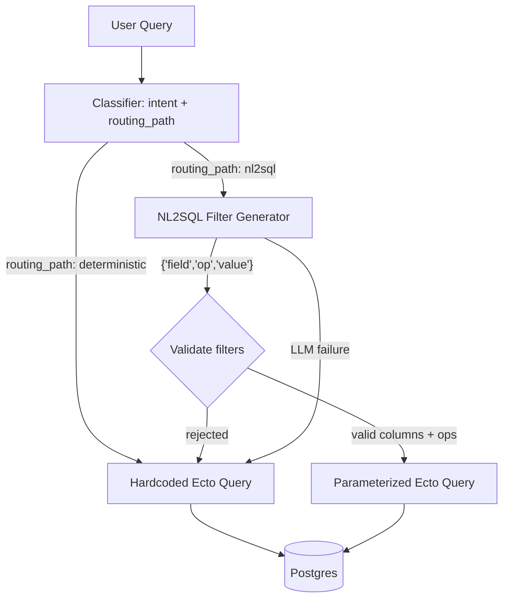

| Tier | When | How | Safety |
|------|------|-----|--------|
| **Deterministic** | Simple name lookup, basic CRUD | Hardcoded Ecto queries from extracted params | No LLM-generated code |
| **NL2SQL** | Complex filters, date ranges, compound conditions | LLM generates structured filter descriptors `{"field", "op", "value"}` | Parameterized Ecto -- LLM never writes SQL. Schema fields derived from Ecto schemas (no drift). Data never sent to LLM. |

The classifier sets `routing_path: "deterministic" | "nl2sql"`. Module routers try deterministic first, escalate to NL2SQL for reads when needed, and always fall back to deterministic on NL2SQL failure.

### Two-pass intent classification

Text-only requests go through a two-pass pipeline. This keeps the expensive Pass 2 prompt focused on a single workflow's actions rather than the full registry.

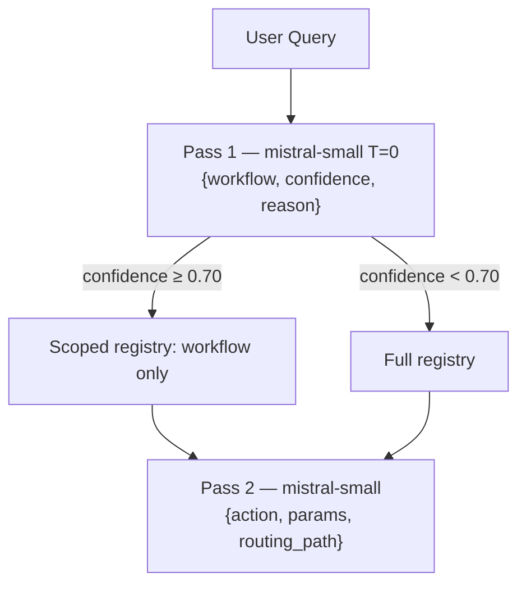

Pass 1 uses `prompt_hint` text from each registry action to guide workflow selection. The LLM returns a confidence score and a short reason. When confidence is above the threshold (0.70), Pass 2 receives only the matched workflow's actions — reducing the prompt size and improving accuracy.

### LLM classification cascade

Pass 2 (action + params) uses a Mistral cascade:

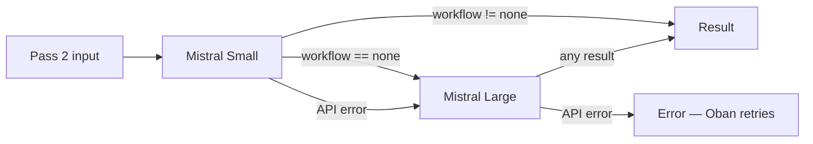

Two distinct escalation reasons:

| Trigger | Escalation | Reason |
|---------|------------|--------|
| Mistral Small returns `workflow: "none"` | Mistral Large | **Quality escalation** — Small couldn't classify the intent |
| Mistral Small API error | Mistral Large | **Reliability fallback** — Small unreachable, try Large |

If both models fail, the error propagates. HTTP gets 500. Telegram user gets no reply. Oban retries up to 3 times.

### Multi-tenancy

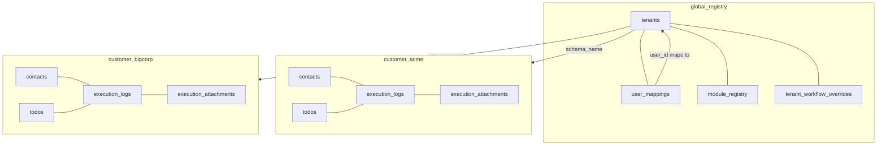

Each tenant gets an isolated Postgres schema (`customer_<tenant_id>`) with its own `contacts`, `todos`, and `execution_logs` tables. The `global_registry` schema holds shared data: `tenants`, `user_mappings`, `module_registry`, and `tenant_workflow_overrides`.

`tenants` stores an optional `admin_email` for business-data export notifications, plus optional `webhook_url` and `webhook_secret` for outbound integrations. `user_mappings` stores an optional `user_email` for GDPR personal-data export delivery.

### Per-tenant workflow access control

By default every workflow is available to every tenant. `tenant_workflow_overrides` gates access at the `workflow_name` level (`"contacts"`, `"todos"`, `"data"`).

**How gating works (two layers):**

1. **Prompt layer** — `ClassifyIntent` calls `RegistryCache.for_tenant(tenant_id)` instead of `RegistryCache.all()`. Disabled workflows are invisible to the LLM — it cannot propose an action it has never seen.
2. **Dispatch layer** — `DispatchModule` checks `SubscriptionCache` before routing. Any step whose workflow is disabled returns `action: "unauthorized"` regardless of what the LLM said.

The `SubscriptionCache` GenServer loads all overrides from `global_registry.tenant_workflow_overrides` at boot into an ETS table (direct reads, no GenServer roundtrip). Updates via the admin API write to both Postgres and ETS atomically — effective immediately across all active connections, no reconnect needed.

**Manage via the admin API:**

```bash
# Disable a workflow for a tenant
curl -X PUT http://localhost:4000/api/admin/subscriptions \
  -H "Authorization: bearer $ADMIN_TOKEN" \
  -H "Content-Type: application/json" \
  -d '{"tenant_id":"acme","workflow_name":"data","enabled":false}'

# Re-enable
curl -X PUT http://localhost:4000/api/admin/subscriptions \
  -H "Authorization: bearer $ADMIN_TOKEN" \
  -H "Content-Type: application/json" \
  -d '{"tenant_id":"acme","workflow_name":"data","enabled":true}'
```

The endpoint is the natural hook for a Stripe entitlement webhook: receive the event, call `PUT /api/admin/subscriptions` with the relevant `tenant_id` and `workflow_name`.

### 2-step mutation confirmation

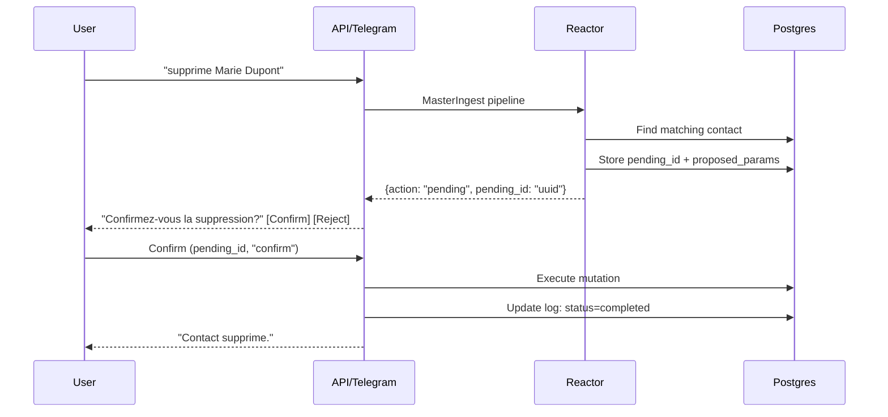

Mutations (update, delete) return a `pending_id`. The user must confirm or reject via:

- **HTTP**: `POST /api/crm/confirm` with `pending_id` and `decision`
- **Telegram**: inline keyboard buttons (Confirm / Reject)

Unconfirmed mutations can be auto-rejected by the `PendingTimeoutWorker`.

### Webhook output

After every completed workflow (action not in `pending`, `clarify`, `unauthorized`), the system can optionally POST the result to the tenant's configured webhook URL. This turns the runner into an integration layer between natural language and enterprise systems (ERP, CRM, HRIS).

```bash
# Configure a webhook for a tenant
curl -X PUT http://localhost:4000/api/admin/webhook \
  -H "Authorization: bearer $ADMIN_TOKEN" \
  -H "Content-Type: application/json" \
  -d '{"tenant_id":"acme","webhook_url":"https://your-system.com/webhook"}'

# Retrieve the HMAC secret (generated on first webhook setup)
curl http://localhost:4000/api/admin/webhook_secret?tenant_id=acme \
  -H "Authorization: bearer $ADMIN_TOKEN"
```

Payloads are signed with HMAC-SHA256 (`x-crm-signature: sha256=...`). The `WebhookWorker` retries up to 5 times with Oban exponential backoff.

### Conversation context

Text-only requests inject the last 3 exchanges (5-minute TTL) into the Pass 2 prompt for pronoun and reference resolution. For example, after "cherche Marie Dupont", a follow-up "supprime-la" correctly resolves "la" to Marie Dupont.

The `ConversationCache` is an ETS table (no GenServer) keyed by `user_id`. Entries are pruned on read/write by TTL and max pair count. File uploads are self-contained and bypass conversation context.

### File cleanup

The `FileCleanupWorker` runs daily (3:30 AM, after `RetentionWorker`) and deletes stored files linked to `execution_logs` older than 180 days. It removes both the physical files from storage and the `execution_attachment` DB records.

## Adding a new workflow

The system is designed so that adding a new domain requires minimal code changes. The example below uses the `todos` workflow as a reference — it has all the patterns (CRUD, NL2SQL, 2-step confirmation, date handling).

### The 6-point contract

#### 1. Registry migration (Pass 1 + Pass 2 prompt data)

Create a migration that inserts rows into `global_registry.module_registry`. Each row declares one action and tells the LLM:
- **what it can do** (`action`)
- **what to extract** (`params_schema`)
- **when to pick this workflow** (`prompt_hint` — short French description)

See `priv/repo/migrations/20260704000003_add_workflow_todos.exs`:

```elixir
execute """
INSERT INTO global_registry.module_registry (workflow_name, action, params_schema, prompt_hint, active) VALUES
  ('todos', 'list',     '{"optional":["due_before","due_after","due_on","contact_name"]}',
   'liste les tâches ; filtre par contact_name, due_before/due_after/due_on pour les dates', true),
  ('todos', 'create',   '{"required":["subject"],"optional":["due_date","contact_name"]}',
   'crée une tâche ; contact_name pour la lier à un contact', true),
  ('todos', 'complete', '{"required":["subject"],"optional":["contact_name"]}',
   'termine/complète une tâche ; contact_name pour lever une ambiguïté', true),
  ('todos', 'update',   '{"required":["subject"],"optional":["new_subject","due_date","start_date","contact_name"]}',
   'modifie une tâche ; contact_name pour lever une ambiguïté', true),
  ('todos', 'delete',   '{"required":["subject"],"optional":["contact_name"]}',
   'supprime une tâche ; contact_name pour lever une ambiguïté', true)
"""
```

**How this flows into the prompts:**

- **Pass 1** (`build_pass1_prompt/1`) — the LLM sees: `- todos: list (liste les tâches...), create (crée une tâche...), ...`
- **Pass 2** (`build_master_prompt/3`) — the LLM sees the full `params_schema` for each action:
  ```
  - todos:
      * list [params — optional: due_before, due_after, due_on, contact_name] (liste les tâches...)
      * create [params — required: subject; optional: due_date, contact_name] (crée une tâche...)
  ```
- **Help** — `Modules.Help` reads `prompt_hint` at runtime and renders it. No code needed.

#### 2. Module file (`execute/1` interface)

Create `lib/crm_reactor/reactors/modules/todos.ex`. The `WorkflowInterpreter` calls `module.execute(context)` with this map:

```elixir
%{
  action: "create",                    # from LLM classification
  params: %{"subject" => "Rappel", "due_date" => "2026-07-12"},  # extracted by LLM
  routing_path: "deterministic",       # or "nl2sql"
  raw_text: "crée un rappel pour demain",  # original user message (for NL2SQL)
  tenant_schema: "customer_acme",      # Postgres schema prefix
  company_name: "Acme Corp",
  admin_email: "admin@acme.com",
  channel: "telegram",                 # "http" | "telegram" | "live"
  user_id: "7363939976",
  log_id: 42                           # execution_log ID (for pending mutations)
}
```

**Must return one of:**

```elixir
# Simple result
{:ok, %{output: "Tâche créée : Rappel", action: "create"}}

# With data (enables $ref chaining between steps)
{:ok, %{output: "...", action: "create", data: %{"todo_id" => 123, "subject" => "Rappel"}}}

# Pending (2-step confirmation for destructive actions)
{:ok, %{output: "Supprimer cette tâche ?", action: "pending", pending_id: "uuid"}}
```

Pattern-match on `action` in function heads:

```elixir
defmodule CrmReactor.Reactors.Modules.Todos do
  def execute(%{action: "create"} = ctx) do
    # Insert into DB using ctx.params and ctx.tenant_schema
  end

  def execute(%{action: "list", routing_path: "nl2sql"} = ctx) do
    # Use QueryBuilder.build_query(Todo, ctx.raw_text)
  end

  def execute(%{action: "list"} = ctx) do
    # Deterministic Ecto query from ctx.params
  end

  def execute(%{action: "delete"} = ctx) do
    # Find todo, store as pending, return pending_id
  end

  def execute(%{action: action}) do
    {:ok, %{output: "Action non supportée : #{action}", action: action}}
  end
end
```

#### 3. Config registration

One line in `config/config.exs`:

```elixir
config :crm_reactor,
  workflow_modules: %{
    "contacts"     => CrmReactor.Reactors.Modules.Contacts,
    "todos"        => CrmReactor.Reactors.Modules.Todos,
    "appointments" => CrmReactor.Reactors.Modules.Appointments,  # ← add here
    "data"         => CrmReactor.Reactors.Modules.DataExport,
    "help"         => CrmReactor.Reactors.Modules.Help
  }
```

This is the **only hardcoded mapping** — it connects workflow names (strings from the LLM) to Elixir modules at compile time.

#### 4. Tenant schema migration (if new tables needed)

If your workflow needs its own database table, add a migration. The table lives inside each tenant's schema (created by `Provisioner`). See how `todos` is created in `lib/crm_reactor/tenants/provisioner.ex`:

```sql
CREATE TABLE IF NOT EXISTS #{schema_name}.todos (
  id bigserial PRIMARY KEY,
  subject text NOT NULL,
  due_date date,
  start_date date,
  done boolean DEFAULT false,
  contact_id bigint REFERENCES #{schema_name}.contacts(id),
  inserted_at timestamptz NOT NULL DEFAULT now()
)
```

For existing tenants, add a migration that iterates over all `schema_name` values and creates the table in each.

#### 5. Subscription gating (optional)

Works automatically. `DispatchModule` checks `SubscriptionCache.enabled?(tenant_id, workflow_name)` before routing. By default all workflows are enabled. To restrict:

```bash
curl -X PUT http://localhost:4000/api/admin/subscriptions \
  -H "Authorization: bearer $ADMIN_TOKEN" \
  -H "Content-Type: application/json" \
  -d '{"tenant_id":"acme","workflow_name":"todos","enabled":false}'
```

No code change needed — the LLM won't even see disabled workflows in its prompt (RegistryCache filters them).

#### 6. Mock classifier (for tests)

Add a pattern to `test/support/mock_classifier.ex` so your tests work without API calls:

```elixir
defp patterns do
  [
    ...
    {~r/crée.*tâche|ajoute.*tâche/, "todos", "create",
     fn _ -> %{"subject" => "Nouvelle tâche", "due_date" => "2026-07-12"} end},
    {~r/liste.*tâche|mes tâches/, "todos", "list", fn _ -> %{} end},
    {~r/termine|complète/, "todos", "complete",
     fn text -> %{"subject" => extract_after(text, ~r/termine|complète/)} end},
    ...
  ]
end
```

### Summary

| # | What | Where | Required? |
|---|------|-------|-----------|
| 1 | Registry rows (workflow + actions + params + hints) | `priv/repo/migrations/` | Yes |
| 2 | Module file with `execute/1` clauses | `lib/crm_reactor/reactors/modules/` | Yes |
| 3 | One line in `:workflow_modules` config | `config/config.exs` | Yes |
| 4 | Tenant schema table | `provisioner.ex` + migration | If new tables |
| 5 | Subscription gating | Admin API call | If restricted |
| 6 | Mock classifier pattern | `test/support/mock_classifier.ex` | For tests |

### What is fully dynamic (zero code changes)

Once the 3 required steps are done:

- **Pass 1 routing** — the LLM sees `prompt_hint` and routes to your workflow
- **Pass 2 param extraction** — the LLM reads `params_schema` and extracts fields
- **Help** — your actions appear automatically in the help response
- **Subscription gating** — works out of the box via admin API
- **Conversation context** — pronoun resolution applies to all workflows
- **Webhook output** — fires for any completed workflow action

## Running

### Prerequisites

- Docker and Docker Compose
- Elixir 1.20+ / OTP 29 (for local development and tests)
- A Mistral API key

### Start the stack

```bash
cp .env.example .env   # edit with your API keys
docker compose up -d
docker compose run --rm app /app/bin/migrate
```

Services:

| Service | Port | Purpose |
|---------|------|---------|
| **app** | `localhost:4000` | Phoenix API + metrics |
| **postgres** | `localhost:5432` | Multi-tenant database (pgvector/pg18) |
| **whisper** | `localhost:8000` | Speech-to-text (faster-whisper-server) |
| **prometheus** | `localhost:9090` | Metrics scraper |
| **grafana** | `localhost:3000` | Dashboards (admin/admin) |

### Provision a tenant and add users

A **tenant** is a company. Each tenant gets an isolated database schema. **Users** are mapped to a tenant by their identifier (Telegram chat ID or an arbitrary string for HTTP).

```bash
# Create a tenant with its first user
curl -X POST http://localhost:4000/api/admin/provision \
  -H "Authorization: bearer $ADMIN_TOKEN" \
  -H "Content-Type: application/json" \
  -d '{"tenant_id":"acme","company_name":"Acme Corp","telegram_chat_id":"7363939976"}'
```

The `telegram_chat_id` becomes the user identifier. Find yours by messaging [@userinfobot](https://t.me/userinfobot) on Telegram.

To add more users to the same tenant, insert into `global_registry.user_mappings`:

```bash
docker compose exec postgres psql -U postgres_admin -d crm_reactor_prod -c \
  "INSERT INTO global_registry.user_mappings (user_identifier, tenant_id) VALUES ('ANOTHER_CHAT_ID', 'acme');"
```

For HTTP-only users (no Telegram), use any stable identifier as `user_id`:

```bash
docker compose exec postgres psql -U postgres_admin -d crm_reactor_prod -c \
  "INSERT INTO global_registry.user_mappings (user_identifier, tenant_id) VALUES ('api-user-1', 'acme');"
```

Multiple users can belong to the same tenant -- they all share the same contacts, todos, and execution logs.

### Deactivate / reactivate a tenant

```bash
# Deactivate (all users locked out)
curl -X POST http://localhost:4000/api/admin/toggle \
  -H "Authorization: bearer $ADMIN_TOKEN" \
  -H "Content-Type: application/json" \
  -d '{"tenant_id":"acme","active":false}'

# Reactivate
curl -X POST http://localhost:4000/api/admin/toggle \
  -H "Authorization: bearer $ADMIN_TOKEN" \
  -H "Content-Type: application/json" \
  -d '{"tenant_id":"acme","active":true}'
```

### Use the CRM

```bash
# Search contacts
curl -X POST http://localhost:4000/api/crm \
  -H "Content-Type: application/json" \
  -d '{"user_id":"YOUR_CHAT_ID","text":"cherche Marie Dupont"}'

# Confirm a mutation
curl -X POST http://localhost:4000/api/crm/confirm \
  -H "Content-Type: application/json" \
  -d '{"pending_id":"<uuid>","decision":"confirm"}'
```

## Tests

Three test tiers:

```bash
# Fast mocked tests (no API calls, ~3s)
mix test

# Full suite including real Mistral API
MISTRAL_API_KEY=... mix test --include external

# Only external tests
MISTRAL_API_KEY=... mix test --only external

# Only NL2SQL tests (multi-result, date-relative queries)
MISTRAL_API_KEY=... mix test --only external test/crm_reactor/nl2sql_test.exs
```

### Test structure

| File | What it tests | API calls? |
|------|---------------|------------|
| `test/crm_reactor/reactors/master_ingest_test.exs` | Full Reactor pipeline with mock classifier | No |
| `test/crm_reactor_web/controllers/crm_controller_test.exs` | HTTP API, 2-step mutations, auth | No |
| `test/crm_reactor_web/controllers/admin_controller_test.exs` | Admin provisioning, tenant toggle | No |
| `test/crm_reactor/tenants/provisioner_test.exs` | Schema creation, cleanup | No |
| `test/crm_reactor/error_recovery_test.exs` | Stuck logs, idempotent retries, error marking | No |
| `test/crm_reactor/gdpr_test.exs` | Data export, erasure, contact deletion, encryption | No |
| `test/crm_reactor/workers/ingest_worker_test.exs` | Oban job execution, Telegram delivery, failure logging | No |
| `test/crm_reactor/workers/pending_timeout_worker_test.exs` | Auto-rejection of expired mutations | No |
| `test/crm_reactor/workers/retention_worker_test.exs` | Log anonymization cron job | No |
| `test/crm_reactor/emails/data_export_email_test.exs` | Usage report email delivery, inline fallback | No |
| `test/crm_reactor/emails/gdpr_export_email_test.exs` | GDPR personal data email with JSON attachment | No |
| `test/crm_reactor/workers/file_cleanup_worker_test.exs` | File retention: delete expired, preserve recent | No |
| `test/crm_reactor/reactors/modules/mutations_isolation_test.exs` | Cross-tenant mutation isolation | No |
| `test/crm_reactor/ai/query_builder_test.exs` | NL2SQL filter generation, validation, Bypass HTTP tests | No |
| `test/crm_reactor/ai/classifier_test.exs` | Real Mistral classification accuracy + classify_workflow/3 | Yes |
| `test/crm_reactor/e2e_test.exs` | Full pipeline with real Mistral (mirrors bash smoke tests) | Yes |
| `test/crm_reactor/nl2sql_test.exs` | NL2SQL: multi-result, company filter, date-relative | Yes |

### Penetration testing

Two independent approaches. Both require the app running with a provisioned tenant.

**1. Manual script** — `priv/strix/pentest.sh` runs 33 deterministic curl checks across 9 categories (prompt injection, auth bypass, tenant isolation, input validation, rate limiting, confirm endpoint, admin injection, header abuse, information disclosure). Fast, reproducible, no external dependencies:

```bash
source .env && bash priv/strix/pentest.sh
```

**2. AI-powered testing** with [Strix](https://github.com/usestrix/strix) — an autonomous pen-testing agent. Uses an LLM to read the instruction file (`priv/strix/instructions.md`) describing the app's architecture, endpoints, and risk areas, then generates targeted exploits contextually.

```bash
# Install (requires Docker Desktop — OrbStack not compatible)
curl -sSL https://strix.ai/install | bash

# Terminal 1: run the app in Docker
docker compose up -d

# Terminal 2: run Strix against the containerized app
export LLM_API_KEY="your-anthropic-or-openai-key"
export STRIX_LLM="anthropic/claude-sonnet-4-20250514"
strix --target http://host.docker.internal:4000 \
      --instruction-file priv/strix/instructions.md -n
```

### Static analysis

```bash
mix credo --strict
mix dialyzer          # first run builds PLT (~2 min)
```

## Failure behavior

### LLM failures

| Failure | Behavior |
|---------|----------|
| Pass 1 (mistral-small) fails / times out | Falls back to single-pass classification with full registry. Logged as warning. |
| Mistral Small returns `workflow: "none"` | Escalates to Mistral Large for Pass 2. |
| Mistral Small API error | Escalates to Mistral Large. |
| Both Mistral Small and Large fail | Reactor step returns `{:error, ...}`. HTTP gets 500. Telegram user gets no reply. Oban retries up to 3 times. |
| Mistral returns unparseable JSON | `Jason.decode/1` returns `{:error, ...}`, propagated as step error. No exception raised. |
| NL2SQL filter validation fails | Falls back to deterministic query with warning log. User still gets a result. |
| NL2SQL returns unknown column | Column silently skipped (logged as warning), query runs without that filter. |

### Infrastructure failures

| Failure | Behavior |
|---------|----------|
| Postgres down | App healthcheck fails. Oban jobs queue in memory briefly, crash after timeout. Docker restarts app. |
| Whisper down | Voice transcription fails. Reactor step errors. Text messages unaffected. |
| App crash | OTP supervisor restarts. Oban jobs survive in Postgres -- replayed on restart. |
| Oban job fails | Retried up to 3 times (`max_attempts: 3`) with exponential backoff. After 3 failures, job moves to `discarded`. |

### Request-level errors

| Error | HTTP response | Telegram response |
|-------|---------------|-------------------|
| Unknown user | 403 `{"error": "Unknown user"}` | No reply (user not in system) |
| Deactivated tenant | 403 `{"error": "Unknown user"}` | No reply |
| Pending mutation not found | 404 `{"error": "Pending action not found"}` | "Action expiree ou introuvable." |
| Invalid admin token | 401 `{"error": "Unauthorized"}` | N/A |
| Workflow not in tenant's subscription | 200 `{"action": "unauthorized", "output": "..."}` | Reply in chat |
| Invalid confirm decision | 400 `{"error": "Invalid decision"}` | N/A |
| Internal error | 500 `{"error": "..."}` | No reply (Oban may retry) |

## Telegram setup

### How it works

There is **one bot** representing your app (e.g. `@MyCrmBot`). Every Telegram user who messages this bot triggers a webhook POST to your server. The bot token identifies your bot, not individual users. Users are identified by their `chat_id` — a unique number Telegram assigns to each account.

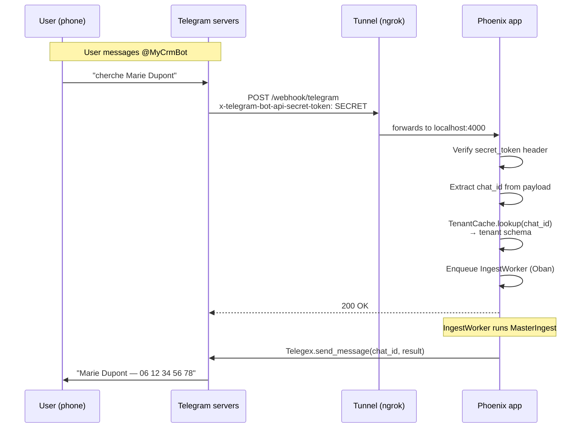

**Three things must be in place** for a message to reach your app:

1. **Webhook registered** — Telegram knows your URL (via `setWebhook` API call)
2. **Tunnel running** — your local server is reachable from the internet
3. **User mapped** — the sender's `chat_id` is linked to a tenant in `global_registry.user_mappings`

### Step 1: Create a bot

1. Message [@BotFather](https://t.me/BotFather) on Telegram
2. Send `/newbot`, follow the prompts, pick a name
3. Copy the **bot token** (e.g. `8995638641:AAGLvk...`)

This token is your app's identity. All users message this one bot.

### Step 2: Get your chat ID

Message [@GetMyIDBot](https://t.me/GetMyIDBot) (or [@userinfobot](https://t.me/userinfobot)) on Telegram. It replies with your numeric `chat_id` (e.g. `7363939976`).

Each Telegram account has a unique `chat_id`. If you have a second phone with a different Telegram account, it will have a different `chat_id`.

### Step 3: Configure environment

Add to your `.env`:

```env
TELEGRAM_BOT_TOKEN=8995638641:AAGLvk...    # from BotFather
TELEGRAM_SECRET_TOKEN=my-random-secret-123  # you choose this, any string
```

The `TELEGRAM_SECRET_TOKEN` is **not** the bot token. It's a separate secret you invent. Telegram sends it as an HTTP header on every webhook call, and your app verifies it to reject forged requests.

```bash
source .env
mix phx.server
```

### Step 4: Expose your server

Telegram's servers must reach your Phoenix app. For local development, use a tunnel:

```bash
# ngrok (recommended — no interstitial page blocking API calls)
ngrok http 4000
# → gives you https://abc123.ngrok-free.app

# localtunnel (may show a "click to continue" page that blocks webhooks)
# npx localtunnel --port 4000 --subdomain my-crm
```

> **Warning:** localtunnel's interstitial page blocks Telegram's automated POST requests, causing 408 timeouts. Use ngrok instead.

### Step 5: Register the webhook with Telegram

This is the step that tells Telegram **where to forward messages**. Without it, messages stay on Telegram's servers and never reach your app.

```bash
curl -X POST "https://api.telegram.org/bot${TELEGRAM_BOT_TOKEN}/setWebhook" \
  -H "Content-Type: application/json" \
  -d "{\"url\": \"https://YOUR-NGROK-URL.ngrok-free.app/webhook/telegram\", \"secret_token\": \"${TELEGRAM_SECRET_TOKEN}\"}"
```

Verify it worked:

```bash
curl "https://api.telegram.org/bot${TELEGRAM_BOT_TOKEN}/getWebhookInfo"
# Should show: "url": "https://...", "pending_update_count": 0, no last_error_message
```

> You must re-run `setWebhook` every time your tunnel URL changes (ngrok gives a new URL on each restart unless you have a paid plan).

### Step 6: Provision a tenant and map your user

Your `chat_id` must be linked to a tenant. Two options:

**Option A: via API** (creates tenant + maps user in one call)

```bash
curl -X POST http://localhost:4000/api/admin/provision \
  -H "Authorization: bearer $ADMIN_TOKEN" \
  -H "Content-Type: application/json" \
  -d '{"tenant_id":"mycompany","company_name":"My Company","telegram_chat_id":"7363939976"}'
```

**Option B: via Admin UI** (if tenant already exists)

Go to `/admin/users` → "Telegram User Mappings" → enter the `chat_id` as "User Identifier", select the tenant, click "Add User".

### Step 7: Test

Send a message to your bot on Telegram: "cherche Marie" — you should see the request in your Phoenix logs and get a response in the chat.

For voice messages, ensure the Whisper container is running (`docker compose up -d whisper`).

### Adding more users

Each new Telegram user needs their `chat_id` mapped to a tenant. They get their `chat_id` from `@GetMyIDBot` and send it to you (the admin). You add the mapping via `/admin/users` or the API.

Multiple users can map to the same tenant — they share the same contacts, todos, and execution logs.

### Troubleshooting

| Symptom | Cause | Fix |
|---------|-------|-----|
| No server logs at all | Webhook not registered or tunnel down | Run `getWebhookInfo`, check `url` field. Restart ngrok if needed. |
| `last_error_message: "408 Request Timeout"` | Tunnel not forwarding (localtunnel interstitial) | Switch to ngrok |
| `401` in Phoenix logs | `secret_token` mismatch | The value in `setWebhook` must match `TELEGRAM_SECRET_TOKEN` env var exactly |
| `403 Unknown user` or no reply | `chat_id` not mapped to a tenant | Add mapping in `/admin/users` |
| Voice messages fail | Whisper container not running | `docker compose up -d whisper` |

## Observability

### Prometheus metrics

Exposed at `GET /metrics` -- scraped by Prometheus every 10s.

Includes: BEAM (memory, schedulers, processes), Phoenix (request duration, status codes), Ecto (query times, pool), Oban (job throughput, queue depth, failures).

### Grafana dashboards

Pre-provisioned at `localhost:3000` (admin/admin):

- **AI** -- classification latency (p50/p95/p99), model distribution, prompt injection attempts
- **Application** -- uptime, running apps
- **BEAM** -- memory, schedulers, GC, ETS, processes
- **Phoenix** -- request duration, response size, status codes
- **Ecto** -- query times, pool checkout, queue times
- **Oban** -- job throughput, queue depth, execution time, failures

## Project structure

```txt
lib/
  crm_reactor/
    ai/
      classifier.ex          # Mistral intent classification: Pass 1 + Pass 2 (Small → Large cascade)
      classifier_behaviour.ex # Behaviour: classify/2, classify/3, classify/4, classify_with_file/4, classify_workflow/3
      conversation_cache.ex  # ETS table: last 3 exchanges per user (5-min TTL, pronoun resolution)
      input_guard.ex         # Prompt injection detection (14 patterns, FR + EN)
      model_pricing.ex       # Compile-time pricing config from priv/ai/model_pricing.json
      prompts.ex             # Prompt builder: master prompt, vision prompt, pass1 prompt (with context injection)
      query_builder.ex       # NL2SQL: structured filters -> Ecto queries
      registry_cache.ex      # ETS cache for global module registry
      subscription_cache.ex  # ETS cache for per-tenant workflow overrides
      telemetry.ex           # AI-specific telemetry events
      whisper.ex             # Voice transcription via Whisper API
    emails/
      data_export_email.ex   # 30-day usage report email builder
      gdpr_export_email.ex   # GDPR personal data export email builder (Art. 20)
    gdpr/
      data_subject.ex        # Right to erasure + data export (+ email delivery)
    mailer.ex                # Swoosh mailer (SMTP / API delivery)
    crm/
      contact.ex             # Ecto schema (per-tenant)
      todo.ex                # Ecto schema (per-tenant)
      execution_log.ex       # Audit trail (per-tenant)
      execution_attachment.ex # File attachment records (per-tenant, FK → execution_logs)
    reactors/
      master_ingest.ex       # Main Reactor pipeline (DAG)
      steps/                 # Reactor step implementations
      modules/
        contacts.ex          # Contacts CRUD + NL2SQL search
        todos.ex             # Todos CRUD + NL2SQL list
        appointments.ex      # Appointments CRUD with Oban reminders (extends todos table)
        data_export.ex       # Usage/cost report (email delivery when admin_email set)
        help.ex              # Dynamic help from registry
        mutations.ex         # 2-step confirm/reject (transaction-wrapped)
    tenants/
      provisioner.ex              # Schema creation, teardown, set_webhook/2
      tenant.ex                   # Global registry schema (+ webhook_url, webhook_secret)
      tenant_cache.ex             # ETS cache for tenant webhook config
      user_mapping.ex             # User -> tenant mapping
      module_registry.ex          # Available workflow modules (+ prompt_hint)
      tenant_workflow_override.ex # Per-tenant workflow access overrides
    telegram.ex              # Send messages + inline keyboards
    telegram/handler.ex      # Telegex webhook handler
    storage.ex               # Storage behaviour (5MB guard)
    storage/
      local.ex               # Filesystem impl: priv/uploads/{tenant}/{uuid}-{filename}
    workers/
      appointment_reminder_worker.ex  # Oban: scheduled appointment reminders (Telegram / webhook)
      file_cleanup_worker.ex          # Oban cron (daily 3:30AM): delete expired stored files
      ingest_worker.ex                # Oban: async Reactor execution
      pending_timeout_worker.ex       # Oban: auto-reject expired mutations
      retention_worker.ex             # Oban cron (daily 3AM): anonymize old logs (GDPR)
      webhook_worker.ex               # Oban: POST result to tenant webhook (HMAC-signed, 5 retries)
    encrypted.ex             # Cloak encrypted + HMAC types
    vault.ex                 # Cloak AES-GCM vault
    prom_ex.ex               # PromEx metrics configuration
  crm_reactor_web/
    router.ex                # API routes + /metrics
    controllers/
      crm_controller.ex      # POST /api/crm, /api/crm/confirm
      admin_controller.ex    # POST /api/admin/provision, /toggle; PUT /api/admin/subscriptions, /webhook
      webhook_controller.ex  # POST /webhook/telegram
      health_controller.ex   # GET /api/health
      metrics_controller.ex  # GET /metrics
    live/
      chat_live.ex           # LiveView chat UI with file upload support
priv/
  ai/
    model_pricing.json       # Per-model pricing and role config (compile-time)
```

## GDPR and ISO 42001 compliance

### Personal data inventory

| Data | Location | Category |
|------|----------|----------|
| `first_name`, `last_name` | `contacts` (per-tenant) | Personal data |
| `email`, `phone` | `contacts` (per-tenant) | Personal data, **encrypted at rest** (Cloak AES-GCM) |
| `user_identifier` (Telegram chat ID) | `global_registry.user_mappings` | Pseudonymous identifier |
| `raw_input` (user message) | `execution_logs` (per-tenant) | May contain personal data |
| `output` (CRM response) | `execution_logs` (per-tenant) | Contains personal data |
| Voice messages | Transient (Whisper) | Biometric data (Art. 9) |

### GDPR controls implemented

| Art. | Requirement | Implementation | Status |
|------|-------------|----------------|--------|
| 15, 20 | Right of access / data portability | `GET /api/admin/subjects/:id/export` -- returns all data as JSON | Done |
| 20 | Data portability via email | `POST /api/admin/subjects/:id/email-export` -- sends personal data as JSON email attachment | Done |
| 17 | Right to erasure | `DELETE /api/admin/subjects/:id` -- redacts logs, removes mapping | Done |
| 17 | Contact erasure | `DELETE /api/admin/contacts/:schema/:id` -- deletes contact, redacts matching logs | Done |
| 25 | Data minimization | `RetentionWorker` anonymizes execution_logs older than 180 days (Oban cron, 3am daily). `FileCleanupWorker` deletes stored files older than 180 days (3:30am daily). | Done |
| 32 | Encryption at rest | `email` and `phone` encrypted via Cloak AES-GCM, searchable via HMAC hashes | Done |
| 32 | Rate limiting | Hammer, 30 req/min per user on CRM and webhook endpoints | Done |

### GDPR items remaining (administrative, not code)

| Art. | Requirement | Status |
|------|-------------|--------|
| 6 | Document lawful basis for processing | Needed |
| 28 | Data Processing Agreement with Mistral AI | Needed |
| 30 | Record of Processing Activities (ROPA) | Needed |
| 33, 34 | Breach notification procedure | Needed |
| 9 | Explicit consent for voice messages (biometric) | Needed |

### ISO 42001 controls implemented

| Clause | Requirement | Implementation | Status |
|--------|-------------|----------------|--------|
| A.4.5 | AI transparency | API responses include `ai_assisted: true` and `model` field | Done |
| A.6.2 | Prompt injection protection | `InputGuard` blocks 14 attack patterns before LLM call, logs attempts | Done |
| A.8.2 | AI decision logging | `execution_logs` records routing_path, token usage, action per request | Done |
| 9.1 | AI monitoring | Custom PromEx plugin: classification latency, fallback rate, injection attempts | Done |
| A.4.6 | Human oversight | 2-step confirmation for all mutations (AI proposes, human decides) | Done |

### ISO 42001 items remaining (administrative, not code)

| Clause | Requirement | Status |
|--------|-------------|--------|
| 6.1 | AI risk assessment document | Needed |
| A.4.4 | AI model card / system description | Needed |
| A.7.3 | Verify Mistral data processing terms (training opt-out) | Needed |
| 7.2 | AI competence requirements for operators | Needed |

### Remaining code-level hardening

| # | Item | Priority |
|---|------|----------|
| 10 | Voice consent flow -- bot asks before transcribing | Medium |
| 12 | CRM endpoint authentication -- currently relies on user_id lookup only | Medium |

### Model pricing

LLM cost tracking is driven by `priv/ai/model_pricing.json` (loaded at compile time via `CrmReactor.AI.ModelPricing`). Each model entry specifies pricing per million tokens and a role (`primary`, `escalation`, `pass1`, `vision`, `review`). The `DataExport` module uses this config to estimate monthly costs in usage reports.
