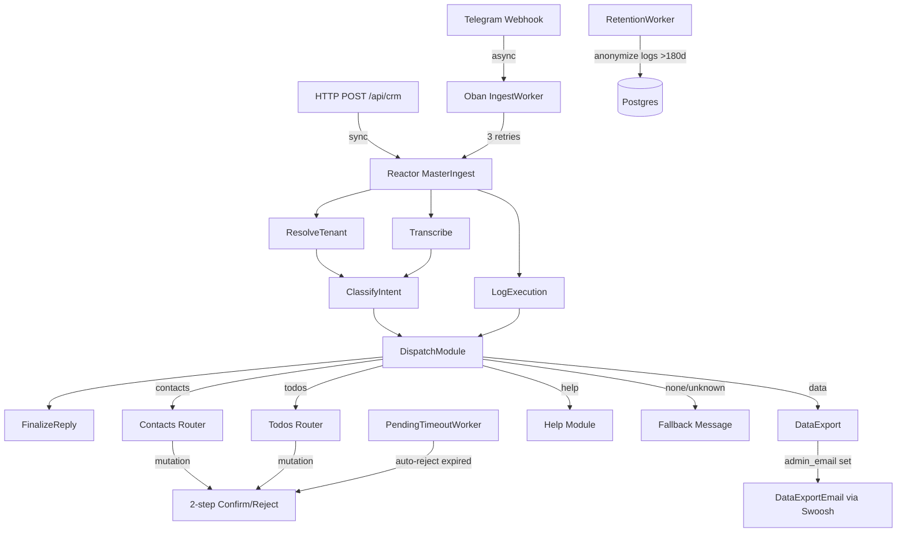
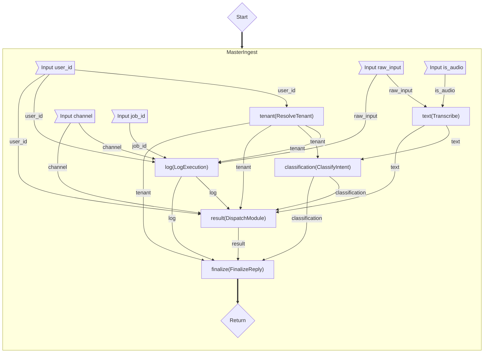
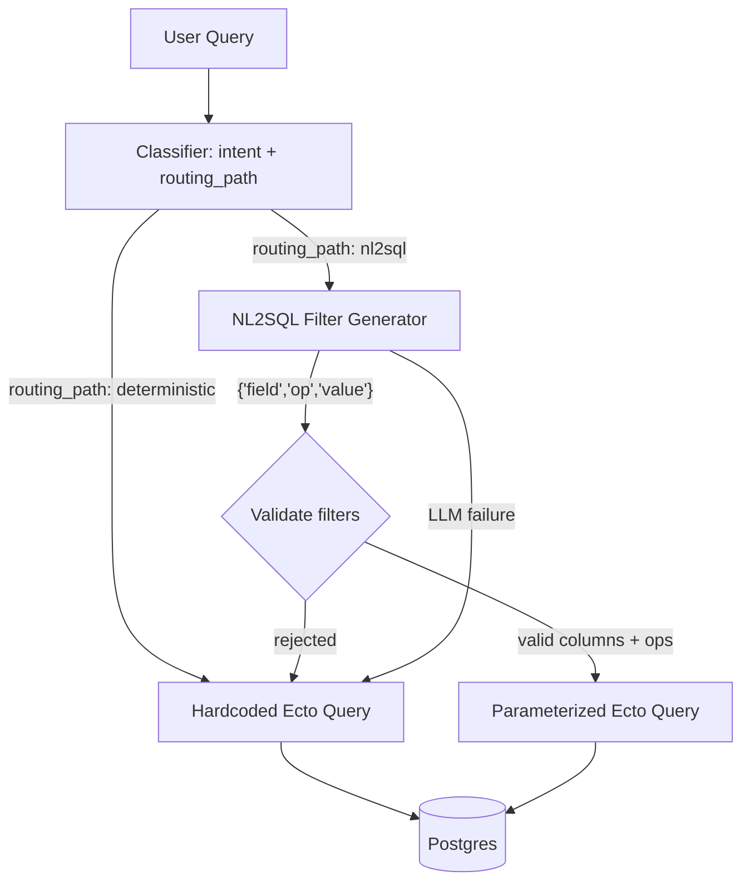
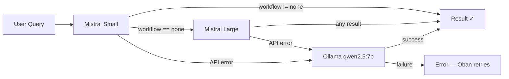
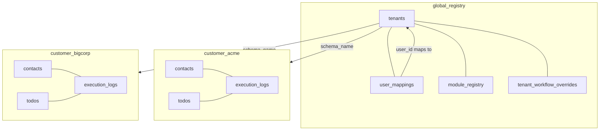
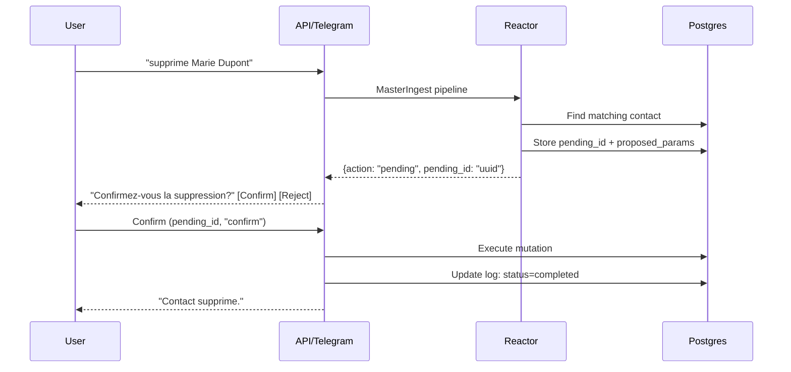

# CRM Reactor

A multi-tenant CRM automation system built in Elixir, ported from an [n8n + Postgres + Mistral AI architecture](https://github.com/ndrean/n8n-saas). Uses **Reactor** for workflow orchestration, **Oban** for durable job processing, and **Phoenix** as the HTTP/webhook gateway.

## Architecture



### MasterIngest Reactor DAG

Auto-generated via `Reactor.Mermaid.to_mermaid/1` -- shows the actual step dependency graph with data flow edges.

Regenerate with:

```bash
mix run -e '{:ok, d} = Reactor.Mermaid.to_mermaid(CrmReactor.Reactors.MasterIngest, direction: :top_to_bottom, output: :binary); IO.puts(d)'
```




### Tiered query system



| Tier | When | How | Safety |
|------|------|-----|--------|
| **Deterministic** | Simple name lookup, basic CRUD | Hardcoded Ecto queries from extracted params | No LLM-generated code |
| **NL2SQL** | Complex filters, date ranges, compound conditions | LLM generates structured filter descriptors `{"field", "op", "value"}` | Parameterized Ecto -- LLM never writes SQL. Schema fields derived from Ecto schemas (no drift). Data never sent to LLM. |

The classifier sets `routing_path: "deterministic" | "nl2sql"`. Module routers try deterministic first, escalate to NL2SQL for reads when needed, and always fall back to deterministic on NL2SQL failure.

### LLM classification escalation



Two distinct fallback reasons, handled separately:

| Trigger | Fallback | Reason |
|---------|----------|--------|
| Mistral Small returns `workflow: "none"` | Mistral Large | **Quality escalation** — Small couldn't classify the intent |
| Mistral Small (or Large) API error | Ollama | **Reliability fallback** — API unreachable, use local model |

Ollama runs on the Mac host (Metal GPU) in development, accessed from Docker via `host.docker.internal:11434`. On the prod VPS it runs in a container without GPU.

### Multi-tenancy



Each tenant gets an isolated Postgres schema (`customer_<tenant_id>`) with its own `contacts`, `todos`, and `execution_logs` tables. The `global_registry` schema holds shared data: `tenants`, `user_mappings`, `module_registry`, and `tenant_workflow_overrides`.

`tenants` stores an optional `admin_email` for business-data export notifications. `user_mappings` stores an optional `user_email` for GDPR personal-data export delivery.

### Per-tenant workflow access control

By default every workflow is available to every tenant. `tenant_workflow_overrides` gates access at the `workflow_name` level (`"contacts"`, `"todos"`, `"data"`).

**How gating works (two layers):**

1. **Prompt layer** — `ClassifyIntent` calls `RegistryCache.for_tenant(tenant_id)` instead of `RegistryCache.all()`. Disabled workflows are invisible to the LLM — it cannot propose an action it has never seen.
2. **Dispatch layer** — `DispatchModule` checks `SubscriptionCache` before routing. Any step whose workflow is disabled returns `action: "unauthorized"` regardless of what the LLM said.

The `SubscriptionCache` GenServer loads all overrides from `global_registry.tenant_workflow_overrides` at boot into an ETS table (direct reads, no GenServer roundtrip). Updates via the admin API write to both Postgres and ETS atomically — effective immediately across all active connections, no reconnect needed.

**Manage via the admin API:**

```bash
# Disable a workflow for a tenant
curl -X PUT http://localhost:4000/api/admin/subscriptions \
  -H "Authorization: bearer $ADMIN_TOKEN" \
  -H "Content-Type: application/json" \
  -d '{"tenant_id":"acme","workflow_name":"data","enabled":false}'

# Re-enable
curl -X PUT http://localhost:4000/api/admin/subscriptions \
  -H "Authorization: bearer $ADMIN_TOKEN" \
  -H "Content-Type: application/json" \
  -d '{"tenant_id":"acme","workflow_name":"data","enabled":true}'
```

The endpoint is the natural hook for a Stripe entitlement webhook: receive the event, call `PUT /api/admin/subscriptions` with the relevant `tenant_id` and `workflow_name`.

### 2-step mutation confirmation



Mutations (update, delete) return a `pending_id`. The user must confirm or reject via:

- **HTTP**: `POST /api/crm/confirm` with `pending_id` and `decision`
- **Telegram**: inline keyboard buttons (Confirm / Reject)

Unconfirmed mutations can be auto-rejected by the `PendingTimeoutWorker`.

## Running

### Prerequisites

- Docker and Docker Compose
- Elixir 1.20+ / OTP 29 (for local development and tests)
- A Mistral API key
- (Optional) Ollama running on the host with `qwen2.5:7b`

### Start the stack

```bash
cp .env.example .env   # edit with your API keys
docker compose up -d
docker compose run --rm app /app/bin/migrate
```

Services:

| Service | Port | Purpose |
|---------|------|---------|
| **app** | `localhost:4000` | Phoenix API + metrics |
| **postgres** | `localhost:5432` | Multi-tenant database (pgvector/pg18) |
| **whisper** | `localhost:8000` | Speech-to-text (faster-whisper) |
| **prometheus** | `localhost:9090` | Metrics scraper |
| **grafana** | `localhost:3000` | Dashboards (admin/admin) |

### Provision a tenant and add users

A **tenant** is a company. Each tenant gets an isolated database schema. **Users** are mapped to a tenant by their identifier (Telegram chat ID or an arbitrary string for HTTP).

```bash
# Create a tenant with its first user
curl -X POST http://localhost:4000/api/admin/provision \
  -H "Authorization: bearer $ADMIN_TOKEN" \
  -H "Content-Type: application/json" \
  -d '{"tenant_id":"acme","company_name":"Acme Corp","telegram_chat_id":"7363939976"}'
```

The `telegram_chat_id` becomes the user identifier. Find yours by messaging [@userinfobot](https://t.me/userinfobot) on Telegram.

To add more users to the same tenant, insert into `global_registry.user_mappings`:

```bash
docker compose exec postgres psql -U postgres_admin -d crm_reactor_prod -c \
  "INSERT INTO global_registry.user_mappings (user_identifier, tenant_id) VALUES ('ANOTHER_CHAT_ID', 'acme');"
```

For HTTP-only users (no Telegram), use any stable identifier as `user_id`:

```bash
docker compose exec postgres psql -U postgres_admin -d crm_reactor_prod -c \
  "INSERT INTO global_registry.user_mappings (user_identifier, tenant_id) VALUES ('api-user-1', 'acme');"
```

Multiple users can belong to the same tenant -- they all share the same contacts, todos, and execution logs.

### Deactivate / reactivate a tenant

```bash
# Deactivate (all users locked out)
curl -X POST http://localhost:4000/api/admin/toggle \
  -H "Authorization: bearer $ADMIN_TOKEN" \
  -H "Content-Type: application/json" \
  -d '{"tenant_id":"acme","active":false}'

# Reactivate
curl -X POST http://localhost:4000/api/admin/toggle \
  -H "Authorization: bearer $ADMIN_TOKEN" \
  -H "Content-Type: application/json" \
  -d '{"tenant_id":"acme","active":true}'
```

### Use the CRM

```bash
# Search contacts
curl -X POST http://localhost:4000/api/crm \
  -H "Content-Type: application/json" \
  -d '{"user_id":"YOUR_CHAT_ID","text":"cherche Marie Dupont"}'

# Confirm a mutation
curl -X POST http://localhost:4000/api/crm/confirm \
  -H "Content-Type: application/json" \
  -d '{"pending_id":"<uuid>","decision":"confirm"}'
```

## Tests

Three test tiers:

```bash
# Fast mocked tests (no API calls, ~0.3s)
mix test

# Full suite including real Mistral API (~17s)
MISTRAL_API_KEY=... mix test --include external

# Only external tests
MISTRAL_API_KEY=... mix test --only external

# Only NL2SQL tests (multi-result, date-relative queries)
MISTRAL_API_KEY=... mix test --only external test/crm_reactor/nl2sql_test.exs
```

### Test structure

| File | What it tests | API calls? |
|------|---------------|------------|
| `test/crm_reactor/reactors/master_ingest_test.exs` | Full Reactor pipeline with mock classifier | No |
| `test/crm_reactor_web/controllers/crm_controller_test.exs` | HTTP API, 2-step mutations, auth | No |
| `test/crm_reactor_web/controllers/admin_controller_test.exs` | Admin provisioning, tenant toggle | No |
| `test/crm_reactor/tenants/provisioner_test.exs` | Schema creation, cleanup | No |
| `test/crm_reactor/error_recovery_test.exs` | Stuck logs, idempotent retries, error marking | No |
| `test/crm_reactor/gdpr_test.exs` | Data export, erasure, contact deletion, encryption | No |
| `test/crm_reactor/workers/ingest_worker_test.exs` | Oban job execution, Telegram delivery, failure logging | No |
| `test/crm_reactor/workers/pending_timeout_worker_test.exs` | Auto-rejection of expired mutations | No |
| `test/crm_reactor/workers/retention_worker_test.exs` | Log anonymization cron job | No |
| `test/crm_reactor/emails/data_export_email_test.exs` | Usage report email delivery, inline fallback | No |
| `test/crm_reactor/emails/gdpr_export_email_test.exs` | GDPR personal data email with JSON attachment | No |
| `test/crm_reactor/ai/classifier_test.exs` | Real Mistral classification accuracy | Yes |
| `test/crm_reactor/e2e_test.exs` | Full pipeline with real Mistral (mirrors bash smoke tests) | Yes |
| `test/crm_reactor/nl2sql_test.exs` | NL2SQL: multi-result, company filter, date-relative | Yes |

### Static analysis

```bash
mix credo --strict
mix dialyzer          # first run builds PLT (~2 min)
```

## Failure behavior

### LLM failures

| Failure | Behavior |
|---------|----------|
| Mistral Small returns `workflow: "none"` | Escalates to Mistral Large. If Large also fails, falls back to Ollama. |
| Mistral API down / 5xx / timeout | Auto-fallback to Ollama (host GPU). Logged as warning. |
| Ollama also down | Reactor step returns `{:error, ...}`. HTTP gets 500. Telegram user gets no reply. Oban retries up to 3 times. |
| Mistral returns unparseable JSON | `Jason.decode/1` returns `{:error, ...}`, propagated as step error. No exception raised. |
| NL2SQL filter validation fails | Falls back to deterministic query with warning log. User still gets a result. |
| NL2SQL returns unknown column | Column silently skipped (logged as warning), query runs without that filter. |

### Infrastructure failures

| Failure | Behavior |
|---------|----------|
| Postgres down | App healthcheck fails. Oban jobs queue in memory briefly, crash after timeout. Docker restarts app. |
| Whisper down | Voice transcription fails. Reactor step errors. Text messages unaffected. |
| App crash | OTP supervisor restarts. Oban jobs survive in Postgres -- replayed on restart. |
| Oban job fails | Retried up to 3 times (`max_attempts: 3`) with exponential backoff. After 3 failures, job moves to `discarded`. |

### Request-level errors

| Error | HTTP response | Telegram response |
|-------|---------------|-------------------|
| Unknown user | 403 `{"error": "Unknown user"}` | No reply (user not in system) |
| Deactivated tenant | 403 `{"error": "Unknown user"}` | No reply |
| Pending mutation not found | 404 `{"error": "Pending action not found"}` | "Action expiree ou introuvable." |
| Invalid admin token | 401 `{"error": "Unauthorized"}` | N/A |
| Workflow not in tenant's subscription | 200 `{"action": "unauthorized", "output": "..."}` | Reply in chat |
| Invalid confirm decision | 400 `{"error": "Invalid decision"}` | N/A |
| Internal error | 500 `{"error": "..."}` | No reply (Oban may retry) |

## Telegram setup

### 1. Create a bot

1. Message [@BotFather](https://t.me/BotFather) on Telegram
2. Send `/newbot`, follow the prompts
3. Copy the bot token

### 2. Configure environment

Add to your `.env`:

```env
TELEGRAM_BOT_TOKEN=123456:ABC-DEF...
TELEGRAM_SECRET_TOKEN=a-random-secret-you-choose
```

### 3. Expose your webhook

The app needs to be reachable from Telegram's servers. For local development, use a tunnel:

```bash
# Using localtunnel
npx localtunnel --port 4000 --subdomain your-subdomain

# Or ngrok
ngrok http 4000
```

### 4. Register the webhook

```bash
WEBHOOK_URL="https://your-subdomain.loca.lt"  # or your ngrok URL
BOT_TOKEN="your-bot-token"
SECRET="your-secret-token"

curl -X POST "https://api.telegram.org/bot${BOT_TOKEN}/setWebhook" \
  -d "url=${WEBHOOK_URL}/webhook/telegram" \
  -d "secret_token=${SECRET}" \
  -d 'allowed_updates=["message","callback_query"]'
```

### 5. Map your Telegram user to a tenant

Your chat ID is the `telegram_chat_id` you used when provisioning. Find your chat ID by messaging [@userinfobot](https://t.me/userinfobot).

```bash
curl -X POST http://localhost:4000/api/admin/provision \
  -H "Authorization: bearer $ADMIN_TOKEN" \
  -H "Content-Type: application/json" \
  -d '{"tenant_id":"mycompany","company_name":"My Company","telegram_chat_id":"YOUR_CHAT_ID"}'
```

### 6. Test

Send a message to your bot: "cherche Marie" -- you should get a response.

For voice messages, ensure the Whisper container is running (`docker compose up -d whisper`).

## Observability

### Prometheus metrics

Exposed at `GET /metrics` -- scraped by Prometheus every 10s.

Includes: BEAM (memory, schedulers, processes), Phoenix (request duration, status codes), Ecto (query times, pool), Oban (job throughput, queue depth, failures).

### Grafana dashboards

Pre-provisioned at `localhost:3000` (admin/admin):

- **AI** -- classification latency (p50/p95/p99), model distribution, Mistral-Ollama fallback rate, NL2SQL latency, NL2SQL-deterministic fallback rate, prompt injection attempts
- **Application** -- uptime, running apps
- **BEAM** -- memory, schedulers, GC, ETS, processes
- **Phoenix** -- request duration, response size, status codes
- **Ecto** -- query times, pool checkout, queue times
- **Oban** -- job throughput, queue depth, execution time, failures

## Project structure

```
lib/
  crm_reactor/
    ai/
      classifier.ex          # Mistral intent classification + Ollama fallback
      classifier_behaviour.ex # Behaviour for test mocking
      input_guard.ex         # Prompt injection detection
      prompts.ex             # Schema-driven prompt builder
      query_builder.ex       # NL2SQL: structured filters -> Ecto queries
      registry_cache.ex      # ETS cache for global module registry
      subscription_cache.ex  # ETS cache for per-tenant workflow overrides
      telemetry.ex           # AI-specific telemetry events
      whisper.ex             # Voice transcription via Whisper API
    emails/
      data_export_email.ex   # 30-day usage report email builder
      gdpr_export_email.ex   # GDPR personal data export email builder (Art. 20)
    gdpr/
      data_subject.ex        # Right to erasure + data export (+ email delivery)
    mailer.ex                # Swoosh mailer (SMTP / API delivery)
    crm/
      contact.ex             # Ecto schema (per-tenant)
      todo.ex                # Ecto schema (per-tenant)
      execution_log.ex       # Audit trail (per-tenant)
    reactors/
      master_ingest.ex       # Main Reactor pipeline (DAG)
      steps/                 # Reactor step implementations
      modules/
        contacts.ex          # Contacts CRUD + NL2SQL search
        todos.ex             # Todos CRUD + NL2SQL list
        data_export.ex       # Usage/cost report (email delivery when admin_email set)
        mutations.ex         # 2-step confirm/reject
    tenants/
      provisioner.ex              # Schema creation, teardown
      tenant.ex                   # Global registry schema
      user_mapping.ex             # User -> tenant mapping
      module_registry.ex          # Available workflow modules
      tenant_workflow_override.ex # Per-tenant workflow access overrides
    telegram.ex              # Send messages + inline keyboards
    telegram/handler.ex      # Telegex webhook handler
    workers/
      ingest_worker.ex       # Oban: async Reactor execution
      pending_timeout_worker.ex  # Oban: auto-reject expired mutations
      retention_worker.ex    # Oban cron: anonymize old logs (GDPR)
    encrypted.ex             # Cloak encrypted + HMAC types
    vault.ex                 # Cloak AES-GCM vault
    prom_ex.ex               # PromEx metrics configuration
    prom_ex/ai_plugin.ex     # Custom AI metrics plugin
    release.ex               # Release migration task
  crm_reactor_web/
    router.ex                # API routes + /metrics
    controllers/
      crm_controller.ex      # POST /api/crm, /api/crm/confirm
      admin_controller.ex    # POST /api/admin/provision, /toggle; PUT /api/admin/subscriptions
      webhook_controller.ex  # POST /webhook/telegram
      health_controller.ex   # GET /api/health
      metrics_controller.ex  # GET /metrics
```

## Adding a new workflow

The system is designed so that adding a new domain (e.g. `appointments`, `invoices`) requires minimal code changes. Most of the system is driven by the `global_registry.module_registry` table.

### What is fully dynamic (DB-driven, zero code changes)

- **System prompt** — `Repo.all(ModuleRegistry)` runs on every request. Adding rows to the table is immediately reflected in what the LLM is told it can do.
- **Param extraction** — `params_schema` per action (required/optional fields) is rendered into the prompt. The LLM learns what to extract from the schema alone.
- **Date resolution, routing_path** — driven by the global prompt instructions, not per-workflow code.
- **Help response** — `Modules.Help` reads the registry at runtime; new workflows appear automatically.

### What requires code changes

**1. A new module file**

Create `lib/crm_reactor/reactors/modules/appointments.ex` implementing `execute/1` pattern-matched on each action:

```elixir
defmodule CrmReactor.Reactors.Modules.Appointments do
  def execute(%{action: "create", params: params, tenant_schema: schema}) do
    # ...
  end

  def execute(%{action: "list", params: params, tenant_schema: schema}) do
    # ...
  end

  def execute(%{action: action}) do
    {:ok, %{output: "Action non supportée : #{action}", action: action}}
  end
end
```

**2. One line in `@module_map`** — `lib/crm_reactor/reactors/steps/dispatch_module.ex`:

```elixir
@module_map %{
  "contacts"     => Modules.Contacts,
  "todos"        => Modules.Todos,
  "data"         => Modules.DataExport,
  "help"         => Modules.Help,
  "appointments" => Modules.Appointments   # ← add this
}
```

This is the **only hardcoded piece** — intentionally so. It maps workflow names to Elixir modules at compile time, giving full pattern-match safety.

**3. DB rows in `global_registry.module_registry`**

```sql
INSERT INTO global_registry.module_registry
  (workflow_name, action, params_schema, prompt_hint)
VALUES
  ('appointments', 'create',
   '{"required":["subject","date"],"optional":["contact_name","duration_min"]}',
   'crée, planifie un rendez-vous'),
  ('appointments', 'list',
   '{"optional":["due_before","contact_name"]}',
   'liste, affiche les rendez-vous'),
  ('appointments', 'delete',
   '{"required":["subject"],"optional":["date"]}',
   'supprime, annule un rendez-vous');
```

**4. A migration for the tenant schema** (if you need new tables)

Add an Ecto migration that creates the new tables inside each tenant schema (using `prefix: schema_name` in Repo calls, same pattern as `contacts` and `todos`).

### Summary

| Step | Location | Required? |
|------|----------|-----------|
| New module file with `execute/1` clauses | `lib/crm_reactor/reactors/modules/` | Yes |
| One line in `@module_map` | `dispatch_module.ex` | Yes |
| DB rows in `module_registry` | SQL / migration | Yes |
| Schema migration for new tables | `priv/repo/migrations/` | If new tables needed |
| Gate per tenant via `PUT /api/admin/subscriptions` | Admin API | If subscription-gated |

New workflows are enabled for all tenants by default. No `tenant_workflow_overrides` row is needed unless you want to restrict access.

## GDPR and ISO 42001 compliance

### Personal data inventory

| Data | Location | Category |
|------|----------|----------|
| `first_name`, `last_name` | `contacts` (per-tenant) | Personal data |
| `email`, `phone` | `contacts` (per-tenant) | Personal data, **encrypted at rest** (Cloak AES-GCM) |
| `user_identifier` (Telegram chat ID) | `global_registry.user_mappings` | Pseudonymous identifier |
| `raw_input` (user message) | `execution_logs` (per-tenant) | May contain personal data |
| `output` (CRM response) | `execution_logs` (per-tenant) | Contains personal data |
| Voice messages | Transient (Whisper) | Biometric data (Art. 9) |

### GDPR controls implemented

| Art. | Requirement | Implementation | Status |
|------|-------------|----------------|--------|
| 15, 20 | Right of access / data portability | `GET /api/admin/subjects/:id/export` -- returns all data as JSON | Done |
| 20 | Data portability via email | `POST /api/admin/subjects/:id/email-export` -- sends personal data as JSON email attachment | Done |
| 17 | Right to erasure | `DELETE /api/admin/subjects/:id` -- redacts logs, removes mapping | Done |
| 17 | Contact erasure | `DELETE /api/admin/contacts/:schema/:id` -- deletes contact, redacts matching logs | Done |
| 25 | Data minimization | `RetentionWorker` anonymizes execution_logs older than 180 days (Oban cron, 3am daily) | Done |
| 32 | Encryption at rest | `email` and `phone` encrypted via Cloak AES-GCM, searchable via HMAC hashes | Done |
| 32 | Rate limiting | Hammer, 30 req/min per user on CRM and webhook endpoints | Done |

### GDPR items remaining (administrative, not code)

| Art. | Requirement | Status |
|------|-------------|--------|
| 6 | Document lawful basis for processing | Needed |
| 28 | Data Processing Agreement with Mistral AI | Needed |
| 30 | Record of Processing Activities (ROPA) | Needed |
| 33, 34 | Breach notification procedure | Needed |
| 9 | Explicit consent for voice messages (biometric) | Needed |

### ISO 42001 controls implemented

| Clause | Requirement | Implementation | Status |
|--------|-------------|----------------|--------|
| A.4.5 | AI transparency | API responses include `ai_assisted: true` and `model` field | Done |
| A.6.2 | Prompt injection protection | `InputGuard` blocks 14 attack patterns before LLM call, logs attempts | Done |
| A.8.2 | AI decision logging | `execution_logs` records routing_path, token usage, action per request | Done |
| 9.1 | AI monitoring | Custom PromEx plugin: classification latency, fallback rate, NL2SQL rejection rate, injection attempts | Done |
| A.4.6 | Human oversight | 2-step confirmation for all mutations (AI proposes, human decides) | Done |

### ISO 42001 items remaining (administrative, not code)

| Clause | Requirement | Status |
|--------|-------------|--------|
| 6.1 | AI risk assessment document | Needed |
| A.4.4 | AI model card / system description | Needed |
| A.7.3 | Verify Mistral data processing terms (training opt-out) | Needed |
| 7.2 | AI competence requirements for operators | Needed |

### Remaining code-level hardening

| # | Item | Priority |
|---|------|----------|
| 10 | Voice consent flow -- bot asks before transcribing | Medium |
| 12 | CRM endpoint authentication -- currently relies on user_id lookup only | Medium |

## Compared to the n8n version

| | n8n | CRM Reactor |
|---|---|---|
| Runtime | n8n + Redis + 7 containers | Single BEAM app + Postgres |
| Memory | ~1.8 GB | ~1.0 GB |
| Workflow engine | n8n visual workflows | Reactor (parallel step DAG) |
| Job queue | Redis | Oban (Postgres-backed) |
| Tests | Bash curl script (22 tests) | ExUnit (257+ tests: mocked + 26 external) |
| Observability | Prometheus + custom Grafana | PromEx (auto-generated dashboards) |
| Fault tolerance | Docker restart | OTP supervision + Oban retries |
